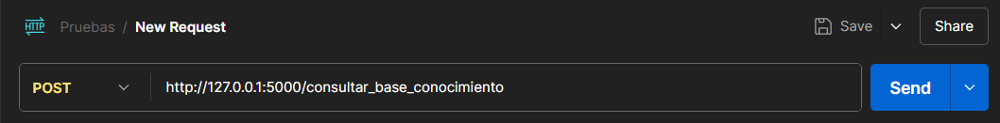
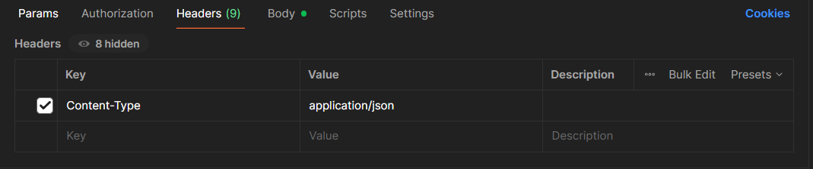
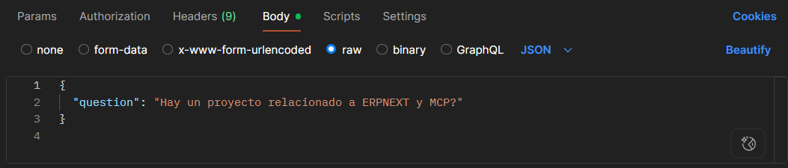
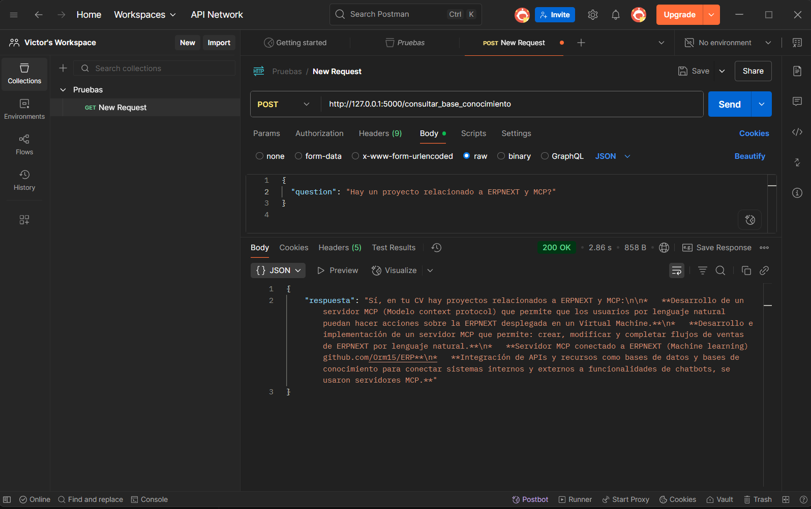
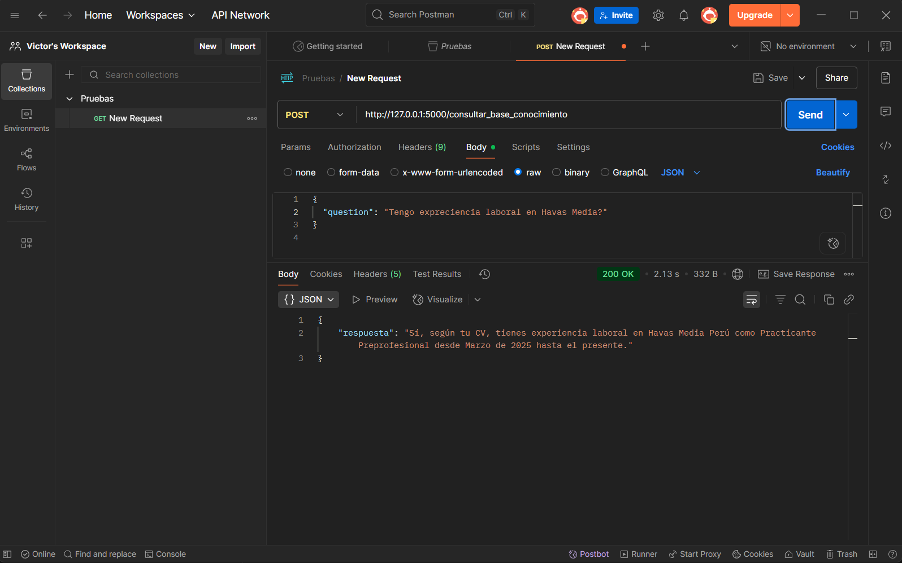
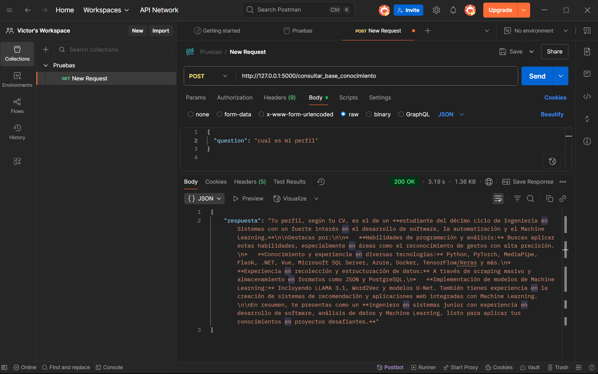

# Proyecto RAG con LangChain y Ollama

Este proyecto implementa un sistema RAG (Retrieval-Augmented Generation) que responde preguntas en base al contenido de documentos PDF, con integración de LangChain, ChromaDB y Ollama.

---

## 📦 Requisitos previos

- [Python 3.12.6](https://www.python.org/downloads/release/python-3126/)
- [Git](https://git-scm.com/)
- Tener instalado `Ollama` y haber descargado previamente un modelo compatible (como `nomic-embed-text` o  `mxbai-embed-large`)

---

## Instalación del proyecto

1. **Clonar el repositorio**

```bash
git clone https://github.com/usuario/repositorio.git
cd repositorio
```

2. **Crear y activar un entorno virtual**

```powershell
python -m venv venvBase

# En Windows:
venvBase\Scripts\activate

# En macOS/Linux:
source venvBase/bin/activate
```

2. **Instala dependencias**

```powershell
pip install -r requirements.txt
```

## Preparar entorno

### ⚙️ Preparación del entorno Ollama y descarga del modelo de embeddings

Este proyecto utiliza **Ollama** para generar *embeddings* de los documentos de forma local, sin depender de servicios en la nube.

---

#### 1. **Instalar Ollama**

##### 🪟 En Windows:

1. Ve al sitio oficial: [https://ollama.com/download](https://ollama.com/download)
2. Descarga el instalador `.msi`
3. Ejecuta la instalación como cualquier aplicación
4. Abre una terminal (CMD o PowerShell) y verifica que esté correctamente instalado:

```bash
ollama --version
```
#### 2. **Descargar el modelo de embeddings**

```bash
ollama pull nomic-embed-text
```

#### 3. **Verificar modelo instalado**

```bash
ollama list
```
#####  Deberías ver una salida similar a:

```sql
NAME                       ID              SIZE      MODIFIED
nomic-embed-text:latest    0a109f422b47    274 MB    just now
```

---

### 🔑 Usar API Key de Gemini gratuita

Para utilizar Gemini, necesitas generar una API Key. Sigue estos pasos:

1. Ingresa a la página oficial de Gemini: [link](https://ai.google.dev/gemini-api/docs)
2. Sigue las instrucciones para crear una cuenta y generar tu API Key.
3. Guarda tu API Key en un archivo `.env` o como variable de entorno para usarla en el proyecto si gustas.

#### Configurar la api key
Recuerda modificar el modelo por el que usaste al generar la Key

```python
from google import genai

def clienteLLM(request : str) -> str:
    client = genai.Client(api_key="Aquí coloca la clave")

    response = client.models.generate_content(
        model="gemini-2.0-flash",
        contents=request,
    )
    return(response.text)
```

---

### 📄 Procesar documentos PDF para el RAG

#### 1. Coloca tus archivos PDF en la carpeta `Docs` del proyecto. Estos archivos serán utilizados por el sistema RAG.

#### 2. Ubícate en el archivo `vector.py` y ejecútalo desde la terminal:

```powershell
python vector.py
```

Debes ver en la terminal que se muestren cuantos documentos fueron creados

### ✅ Resumen de configuración

#### Hasta este punto, ya tienes todo listo para probar el proyecto:

- Instalaste Python y las dependencias necesarias en un entorno virtual.
- Descargaste e instalaste Ollama y el modelo de embeddings.
- Generaste y configuraste tu API Key de Gemini.
- Subiste tus archivos PDF a la carpeta `Docs`.
- Procesaste los documentos ejecutando `vector.py` y verificaste que se crearon en la base de datos.

Ahora puedes continuar con la prueba del sistema RAG y realizar preguntas basadas en tus documentos.

---

## 🚦 Probar el backend local

Ubícate en la carpeta raíz del proyecto y ejecuta el archivo `main2.py`:

```powershell
python main2.py
```
Deberías ver algo similar a:

```powershell
 * Serving Flask app 'main2'
 * Debug mode: off
WARNING: This is a development server. Do not use it in a production deployment. Use a production WSGI server instead.
 * Running on all addresses (0.0.0.0)
 * Running on http://127.0.0.1:5000
 * Running on http://192.168.127.213:5000
Press CTRL+C to quit
```
El proyecto ya está listo

### Preparación de entorno

#### 1. **Ingresa a postman**

Abre postman y crea un Collections

#### 2. **Prepara el url**



#### 3. **Prepara el Header**



#### 3. **Prepara el Body**



### Pruebas

#### 1. **Solicitando información de proyecto MCP y ERPNEXT**



#### 2. **Experiencia laboral en Havas Media**



#### 3. **Solicitando información de perfil**

